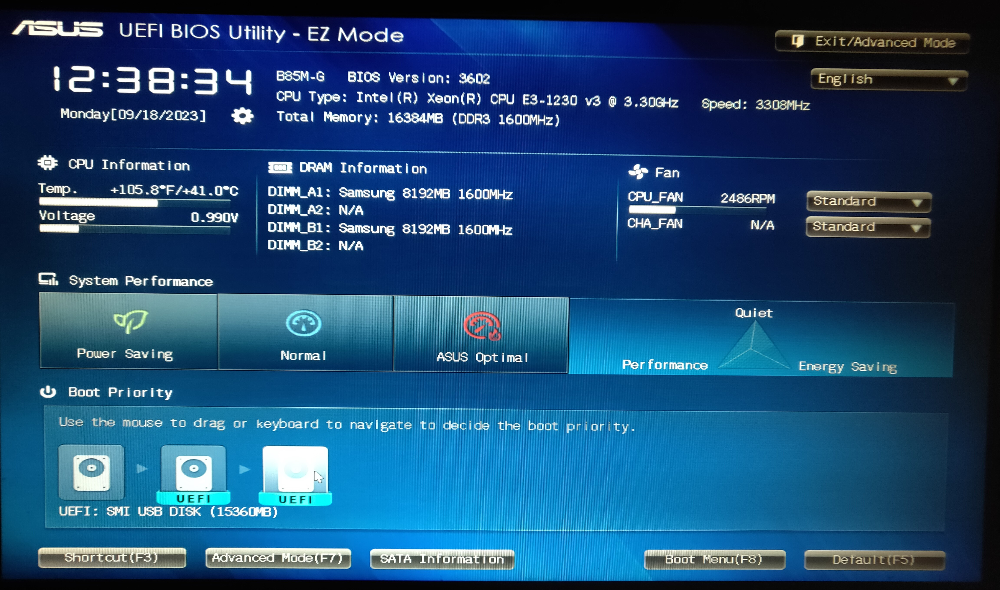
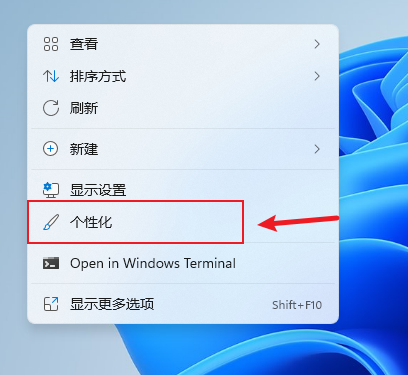

## Windows 系统安装教程

### 写在前面
本教程旨在为想要给新机装系统或是重装系统的朋友提供一点帮助，我将尽量仔细地介绍其流程。由于教程发布时间已是2023年秋季，因此教程将以目前主流的主板配置及 **Windows11** 系统为例进行讲解。安装其它版本windows系统的方法基本一致，便不在此赘述。

### 1. 启动U盘的制作
一台全新的电脑硬件装完后，其硬盘上并没有能够供我们使用的系统，那么我们要如何将系统写入到硬盘上呢？

我们可以使用启动U盘。启动U盘又叫PE盘，其中 **PE** 是 **Preinstallation Environment** 的缩写，指Windows的轻量版本。换句话说，我们是先在U盘上写入一个小系统，然后通过进入这个小系统将正式使用的系统写入硬盘。

**注： 如果你已经有启动U盘，或是已在网络上购买，请直接跳转到 第3部分-系统的安装。**

#### 1.1 U盘的选择
由于后续需要拷入系统镜像，因此笔者建议选择容量16GB或以上的U盘。该U盘能被正常识别且不是扩容盘（部分无良商家使用软件将小容量U盘进行虚标，达到伪装大容量U盘的效果）即可，无过多要求。

**提示：天上不会掉馅饼！！！像下图这种同等容量下价格远低于同类产品的U盘请直接跳过！**


#### 1.2 启动盘制作软件的下载
网络上用来制作启动盘的软件不在少数，这里仅介绍**微pe**这款软件。**制作启动盘会清除U盘数据，请记得备份文件！**

**微pe**：<a href="https://mirrors.sdu.edu.cn/software/Windows/WePE/WePE_64_V2.3.exe">下载（如一直加载请尝试刷新网页）</a>

如若遇到浏览器提示是否保留文件，则一律选择保留，如下图所示。

<div align=center>
    <br>
    
    <br>
    
    <br>
    
    <br>
</div>

先来介绍**微pe**的使用：
首先将电脑的杀毒软件等退出，以防止制作途中程序被意外中止。
打开软件后（如遇windows弹窗一律选择允许），点击右下角的U盘图标。
<div align=center>
    
    <br>
</div>
在待写入U盘选项中选择要制作的U盘，其它选项保持默认即可，然后点击立即安装。
<div  align=center>
    
    <br>
</div>

点击开始制作,接下来等待软件制作完成，其速度视U盘读写性能等因素而异。再次提示：**制作启动盘会清除U盘数据，请记得备份文件！**
<div  align=center>
    
    <br>
    
    <br>
    
    <br>
</div>

至此启动盘制作完成。

### 2. 系统镜像的下载

如果你恰巧是一名吉大学子，那么我建议你前往吉大官方的网站下载：<a href="https://zbhrj1.jlu.edu.cn/download/windows11.html">吉大正版</a>

如果不是校友也没关系，可以通过我分享的网盘链接下载：<a href="https://cloud.189.cn/t/NvInMv3ueA3e">天翼网盘链接 （访问码：ri7v）</a>
或前往这个网站：<a href="https://next.itellyou.cn/">NEXT, ITELLYOU</a>

该网站支持QQ等登录方式，登录后进入Windows11的下载页面。
<div align=center>
    
    <br>
    
    <br>
    
    <br>
    
    <br>
</div>

推荐选择 **Windows 11 (business editions)**，网站提供ED2K和BT两种下载方式。使用迅雷、qBittorrent等工具或是百度网盘的离线下载功能均可进行下载。

<div>
    
</div>

下载完成后即得到Windows11的镜像（.iso）文件，将其拷贝到刚刚制作好的启动U盘中，就可以开始安装系统了。

### 3. 系统的安装

#### 3.1 进入Bios或UEFI
关于Bios是什么，想要了解更多的朋友请移步这篇文章：<a href="https://zhuanlan.zhihu.com/p/445093884">什么是 BIOS，BIOS 有什么用？</a>

本教程以系统安装为主，在此不多介绍。

将启动U盘插入电脑USB接口（请使用主板上的接口而非机箱上的接口，即机箱后面的接口）。对多数主板来说，按下开机键，屏幕出现画面后按下键盘上的 **DEL** 键，即可进入Bios。该方法对于部分主板或笔记本可能并不适用，此时请在网络上搜索 **主板品牌/笔记本品牌+进bios**，按照提示操作即可。

#### 3.2 设置启动项
由于各个品牌主板的Bios界面可谓百花齐放————部分主板只能使用键盘操作，而另一些主板则支持鼠标的拖拽、点击等操作，因此为这部分的介绍带来了一定困难。总体来说，上述两种操作方式中后者已成为主流，本教程将主要介绍此种操作方式下的设置。

进入Bios后，找到带有“Boot”字样的方框。该方框下一般会有多个硬盘图标（下图中有三个），将鼠标指针移动到该图标上时，会显示其对应的信息。
<div align=center>
    
    <br>
</div>
如下图，我们找到带有“USB”字样的图标，将其拖拽到方框的第一位。
<div align=center>
    
    <br>
</div>
设置好顺序后，按下键盘上的“F10”按键。点击“Save Changes”按钮。
<div align=center>
    
    <br>
</div>
如再次弹窗询问是否保存，则点击“Yes”确认即可。
<div align=center>
    
    <br>
</div>

完成启动项的设置及保存设置后，电脑将自动重启进入PE。接下来就是对硬盘进行分区及系统安装了。

此处附上老主板设置启动项方法：<a href="https://www.baiyunxitong.com/jiaocheng/4728.html">老主板Bios设置U盘启动|怎么把USB设为第一启动项</a>

#### 3.3 硬盘分区
打开桌面上的DiskGenius软件。
<div align=center>
    
    <br>
</div>
在软件左侧的硬盘列表中找到要安装系统的硬盘（可以通过硬盘品牌关键字、硬盘容量等信息来确认）。
<div align=center>
    
    <br>
</div>
点击选中这个硬盘，右键后点击“快速分区”选项。
<div align=center>
    
    <br>
</div>

分区表类型我们选择**GPT(GUID)**，并勾选“创建新ESP分区”和创建“MSR分区”。
如果你有两块硬盘，我的建议是分区数量选择自定-1个分区。

如果仅有一块硬盘，那么分区数量选择自定-2个分区即可。在选择两个分区的情况下，要更改系统盘的大小，需要点击右侧高级设置中系统表卷前上锁的图标，使其变为解锁状态，才可以输入自己想要的大小（建议200到300GB）。

设置好分区数量和大小之后，点击“对齐分区到此扇区的整数倍”旁的选项框，选择“8扇区-4096字节”，并保持该选项的勾选。

<div align=center>
    
    <br>
</div>

此时点击“确定”，软件将**清除硬盘数据**，并对其进行分区。

#### 3.4 系统烧录（安装）
完成硬盘分区后，我们关闭DiskGenius回到桌面，打开“Windows安装器”。
<div align=center>
    
    <br>
</div>
首先选择安装映像文件位置，也就是我们存放在启动U盘中的Windows系统镜像。找到该iso文件并将其选中就可以了。
<div align=center>
    
    <br>
</div>
<div align=center>
    
    <br>
</div>

第二个选项是可引导驱动器位置。一般来说，如果上一步的硬盘分区没有问题，这里软件是能自动找到对应的引导分区的。你也可以点开再确认一遍，即要安装系统的硬盘的ESP分区，在图中是非常显眼的绿色，将其选中即可。注意**不要**选择启动U盘下的引导分区（带有“可移动磁盘”、“USB”等字样）。

<div align=center>
    
    <br>
</div>

接下来是选择系统安装的分区了，找到目标硬盘下带有“系统”字样的分区选中。
<div align=center>
    
    <br>
</div>

如果你使用的是笔者提供的镜像文件，那么选择“专业工作站”版本的Windows会是一个不错的选择。
关于各个版本的Windows有何区别（对Windows11来说基本通用），详见：<a href="https://www.zhihu.com/question/41293675">Windows 10 操作系统一共有几个版本，各自有什么区别？</a>

<div align=center>
    
    <br>
</div>
完成上述设置后，点击“安装”按钮。软件将再次弹窗，点击“确定”即开始安装。
<div align=center>
    
    <br>
</div>

安装速度视硬盘速度而定，请耐心等待安装完成。当软件提示安装完成后，电脑将自动重启，此时拔掉启动U盘，电脑就开始启动Windows11了。

### 4. 后续设置

系统安装完成后，我们还要对其进行一系列设置，使其符合我们的使用习惯（类似于给毛坯房装修）。这部分比较主观，请结合个人使用习惯及不同场景的需求来进行设置。

#### 4.1 系统激活
本教程介绍的系统及Office激活均为使用KMS激活的方式。关于什么是KMS激活，感兴趣的朋友可以自行搜索。如果是想要支持微软的朋友也可以跳过这部分在微软官网自行购买相关服务。

在屏幕底部任务栏的搜索框中输入“cmd”，搜索结果会出现一个名为“命令提示符”的应用。我们点击右边的“以管理员身份运行”。此时弹窗询问是否允许应用对设备进行更改，点击“是”。
<div align=center>
    
    <br>
</div>

在弹出的命令行中输入并回车:
```
slmgr /skms kms.03k.org
```

<div align=center>
    
    <br>
</div>

系统会弹窗提示kms服务器设置成功，关闭此弹窗并在命令行中输入并回车：
```
slmgr /ato
```
运行后电脑将尝试连接服务器并激活系统，此过程消耗时间不尽相同，只要后续弹窗提示激活成功即可。
<div align=center>
    
    <br>
</div>

至此，Windows系统激活完成。

**附：** Windows安装完成时桌面上默认图标不包含“此电脑”。要添加此图标，请在激活Windows系统后右键桌面，点击“个性化”,依次按如下四张图点击“主题”-“桌面图标设置”-勾选“计算机”-“确定”，即可在桌面看到“此电脑”图标。

<div align=center>
    
    <br>
    
    <br>
    
    <br>
    
    <br>
</div>


#### 4.2 系统更新
系统安装完成之初，部分硬件可能缺乏驱动程序而难以运行。如果我们打开设备管理器，则可能会看到一些带有黄色感叹号的设备。

<div align=center>
    
    <br>
</div>
<div align=center>
    
    <br>
</div>

Windows会自动检测缺少的驱动程序，并通过系统更新的方式进行推送。
右键屏幕下方任务栏上的Windows标志（田字标），点击设置。
<div align=center>
    
    <br>
</div>
点击侧边栏的“Windows更新”选项，系统将会检测更新，检测完成后点击“立即下载”按钮开始更新。期间可能需要多次重启，重启完成后请重复上述步骤，直到没有更新项为止。

<div align=center>
    
    <br>
</div>

#### 4.3 文件夹设置
很多朋友在使用电脑一段时间后，会发现C盘发红，也就是容量不够了。此时要清理起来往往比较麻烦。因此我建议一开始就在D盘将对应的文件夹建好，并将系统默认的文件夹移动过去。其具体操作如下：
在D盘新建如下文件夹：
<div align=center>
    
    <br>
</div>
点击侧边栏的“此电脑”，会看到6个带彩色图标的文件夹。很多软件的文件默认存放路径都会在这几个文件夹下。

右键“视频”，依次点击“属性”-“位置”-“移动”，找到刚刚在D盘新建的“Videos”文件夹并选中，最后点击“确定”。

<div align=center>
    
    <br>
</div>

<div align=center>
    
    <br>
</div>

对其余文件夹也都依次进行如上操作，其对应关系如下表：

|文件夹|目标文件夹|
|---|---|
|视频|Videos|
|图片|Pictures|
|文档|Documents|
|下载|Downloads|
|音乐|Music|
|桌面|Desktop|

移动完成后，在桌面存放的文件、浏览器默认的下载位置就都在D盘了，后续可以省去一些麻烦。

#### 4.4 Office的安装与激活
**安装部分**
这里推荐使用 **Office Tool Plus** 安装并激活Office。
网站：<a href="https://otp.landian.vip/zh-cn/download.html">Office Tool Plus</a>
打开网页后选择一个下载方式。
<div align=center>
    
    <br>
</div>
下载完成后解压得到的压缩包，运行其中的 Office Tool Plus.exe 文件。
<div align=center>
    
    <br>
</div>
此时系统会弹窗，我们点击“更多信息”，然后点击“仍要运行”。
<div align=center>
    
    <br>
</div>
<div align=center>
    
    <br>
</div>

系统将再次弹窗：“你要允许应用对你的设备进行更改吗？”，点击“是”（此处无法截图，因此用文字说明代替）。
接下来是Office Tool Plus的许可条款，我们同样点击“是”。
<div align=center>
    
    <br>
</div>
进入Office Tool Plus主页后，点击侧边栏的“部署”选项。
<div align=center>
    
    <br>
</div>
部署模式等各个选项按照图中所示设置即可。
<div align=center>
    
    <br>
</div>
点击“添加产品”，在输入框中键入“mondo”，选中“Office Mondo 2016”，并点击确认。

**注：Mondo 2016解锁了Office365功能，因此推荐使用此版本。如有特定版本需求请自行选择对应版本。**
<div align=center>
    
    <br>
</div>
接下来在产品选项中选择自己想要安装的软件，图中勾选了Word,Excel和PowerPoint，有其它软件需求的朋友将对应软件选上即可。
<div align=center>
    
    <br>
</div>
设置完后，点击“开始部署”。
<div align=center>
    
    <br>
</div>
<div align=center>
    
    <br>
</div>
软件将开始下载、安装Office，请保持网络连接，耐心等待部署完成。
<div align=center>
    
    <br>
</div>

**激活部分**
点击侧边栏的“激活”选项。
<div align=center>
    
    <br>
</div>
展开“许可证管理”右边的三角形图标，可以看到三个选项。我们点击“安装许可证”右边的“安装”按钮。
<div align=center>
    
    <br>
</div>
在许可证列表的搜索框里输入“mondo”，选中其对应的批量许可证并点击确定。如果你在安装时选择了其它版本的Office，请搜索对应的版本并选择相应许可证。
<div align=center>
    
    <br>
</div>
点击“KMS管理”选项，程序会提供一个输入框。在此输入框中键入：

```
kms.03k.org
```
而后点击“设置主机”，这样就把kms主机设置好了。
<div align=center>
    
    <br>
</div>
现在我们点击“激活”按钮，程序将开始激活Office。
<div align=center>
    
    <br>
</div>
当弹窗提示出现“产品激活成功”字样时，即可正常使用Office了。如果无法激活，请检查许可证版本是否为Office对应的版本，以及KMS服务器是否设置好了，也可以尝试多点两遍激活按钮。
<div align=center>
    
    <br>
</div>
打开Word的账户页面，可以看到Office确实已成功激活。
<div align=center>
    
</div>

### 写在最后
正如之前所说，此教程尽可能详细地介绍了Windows系统安装过程中需要注意的各种问题。部分朋友，包括我本人可能都会觉得教程内容过于啰嗦。因为我自己也体会过新手阶段不知所措的感觉，所以才在各种看似不必要的地方反复强调，希望能够让缺少相关经验的朋友少走一点弯路。由于本人水平有限，可能在一些问题上犯错而不自知，也希望读者能够提出意见，共同进步！

<div align=right>
    G@JLU
</div>
<div align=right>
    2023年9月19日
</div>